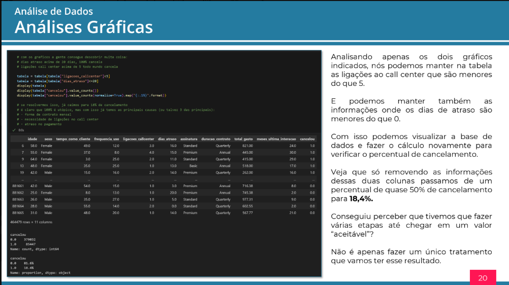

# 📊 Jornada Python — Aula 02

Projeto desenvolvido durante a **Jornada Python**, evento promovido pela **Hashtag Treinamentos**.

Nesta aula, o foco foi aprender a utilizar o **Python para análise de dados**, trabalhando com uma base de dados de uma empresa fictícia para identificar padrões relacionados ao **cancelamento de clientes**.

---

## 📚 Sobre a aula

O projeto utiliza uma base de dados contendo informações sobre clientes de uma empresa fictícia.

Entre os dados analisados estão:

- Idade
- Sexo
- Tempo como cliente
- Frequência de uso
- Ligações para o Call Center
- Dias em atraso
- Assinatura
- Duração do contrato
- Total gasto
- Meses desde a última interação
- Cancelamento da assinatura

O objetivo foi **tratar e analisar os dados** para encontrar informações úteis para a empresa, incluindo possíveis fatores relacionados ao cancelamento de clientes.

---

## 🛠️ Tecnologias utilizadas

- **Python**
- **Pandas**
- **Plotly**
- **Jupyter Notebook**
- **Visual Studio Code**

---

## 📊 Análise de dados

Durante a aula, foi utilizada a biblioteca **Pandas** para importar e manipular a base de dados em formato `.csv`.

Entre os procedimentos realizados estão:

- Importação da base de dados
- Remoção de informações desnecessárias
- Tratamento dos dados
- Organização das informações
- Análise dos clientes
- Identificação de padrões de cancelamento
- Criação de gráficos para facilitar a interpretação dos dados

A base utilizada possui informações sobre clientes e indica se cada cliente **cancelou ou não sua assinatura**.

---

## 📈 Visualização dos dados

A biblioteca **Plotly** foi utilizada para criar gráficos que ajudam a visualizar os resultados das análises.

Os gráficos permitem observar os dados de maneira mais clara e identificar padrões presentes na base.

---

## 📓 Jupyter Notebook

O projeto foi desenvolvido utilizando **Jupyter Notebook dentro do Visual Studio Code**.

A utilização de blocos permite executar e analisar cada etapa do código separadamente, facilitando a visualização dos resultados durante o desenvolvimento.

---

### 📚 Projeto apresentado na apostila

  

---

## 🎓 Jornada Python

Este projeto faz parte da **Jornada Python da Hashtag**, realizada em **2024**.

A jornada teve duração total de **8 horas** e foi concluída em **10/10/2024**.

Este repositório contém o projeto desenvolvido na **Aula 02 — Analisando dados com Python**.

---

## 👩‍💻 Autora

**Lua**

Estudante de **Sistemas para Internet**, com foco em desenvolvimento e tecnologia.

---

✨ Projeto desenvolvido como parte da minha jornada de aprendizado em Python.
